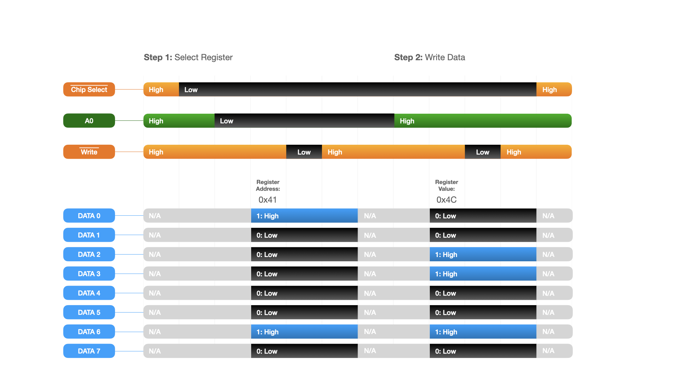

# Articles 1-3
The first three articles provide an introduction to the YM3812 sound processor as well as the basic schematic and code necessary to get things up and running.

## Current Articles

### <a href='https://www.thingsmadesimple.com/2022/11/28/ym3812-part-1-register-basics/'>YM3812 Part 1: Register Basics</a>
Focuses on FM Synthesis basics, the YM3812's register map and electrically controlling the chip's pins. You can find the register map and timing diagrams below (or in the Documentation folder).

### YM3812 Part 2: FACE Reveal
Introduces a basic implementation of the YM3812 circuit controlled by an AVR128DA28 microcontroller that we will build upon in future articles. Think of it as a "Hello World"-like starting point that ensures the circuit works and that we can upload code into the microcontroller. We cover the function of each IC, the schematic, and after building it on breadboard, how to program it through the Arduino IDE.

### YM3812 Part 3: Getting Classy (Coming Soon)
Walks through the implementation of the YM3812 class and other code that we used (but didn't discuss) in the second article. We cover the sendData and reset functions as well as the bit manipulation function that inserts sub-8-bit numbers into 8-bit registers. Then with these building blocks in place, we implement the register manipulation functions for all of the global, channel and operator level settings.

## Documentation:
The documentation folder contains a couple of helpful charts:
### Register Map
The register map shows where each setting is located on the chip.

### Timing Chart
The Timing Chart visually describes the order of events used to update a register on the YM3812.

### Schematic
The schematic folder includes a basic schematic used to get the YM3812 up and running.

