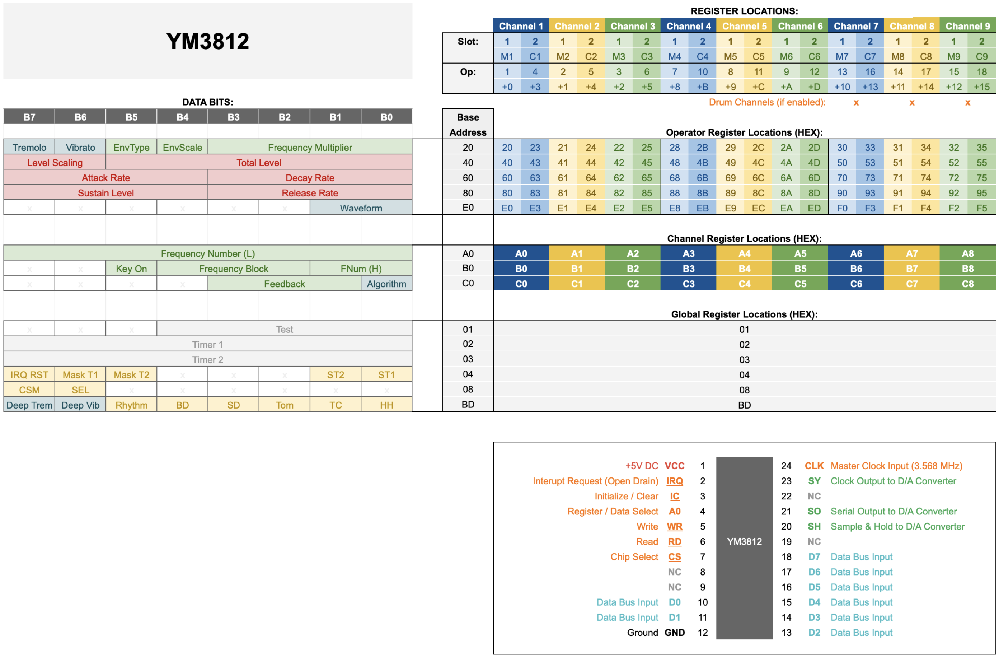
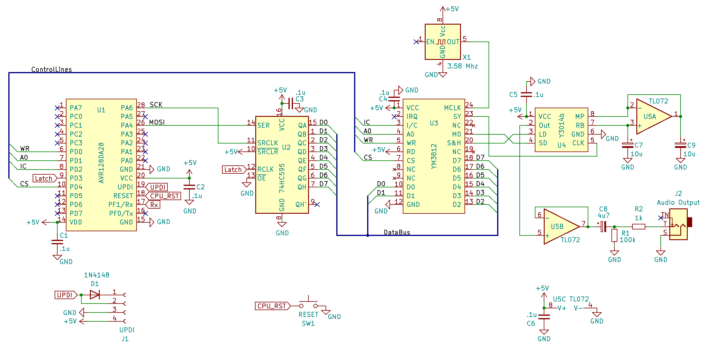

# Articles 1-3
The first three articles provide a brief introduction to the YM3812 sound processor and provide the basic schematic and code needed to get things up and running.

## Current Articles

### <a href='https://www.thingsmadesimple.com/2022/11/28/ym3812-part-1-register-basics/'>YM3812 Part 1: Register Basics</a>
Focuses on FM Synthesis basics, the YM3812's register map and electrically controlling the chip's pins.

### YM3812 Part 2: FACE Reveal
Introduces a basic implementation of the YM3812 circuit controlled by an AVR128DA28 microcontroller that we will build upon in future articles. Think of it as a "Hello World"-like starting point that ensures the circuit works and that we can upload code into the microcontroller. We cover the function of each IC, the schematic, and after building it on breadboard, how to program it through the Arduino IDE.

### YM3812 Part 3: Getting Classy (Coming Soon)
Walks through the implementation of the YM3812 class and other code that we uploaded into the breadboard module in the second article. We cover the sendData and reset functions as well as the bit manipulation function that inserts sub-8-bit numbers into 8-bit registers. Then with these building blocks in place, we implement register manipulation functions for all of the global, channel and operator level settings.

## Documentation:
The documentation folder contains a couple of helpful charts:

The register map shows where each register setting is located on the chip.

The Timing Chart visually describes the order of events used to update a register on the YM3812.

The schematic folder includes a basic schematic to use to get the YM3812 up and running with a minimal amount of fuss.
