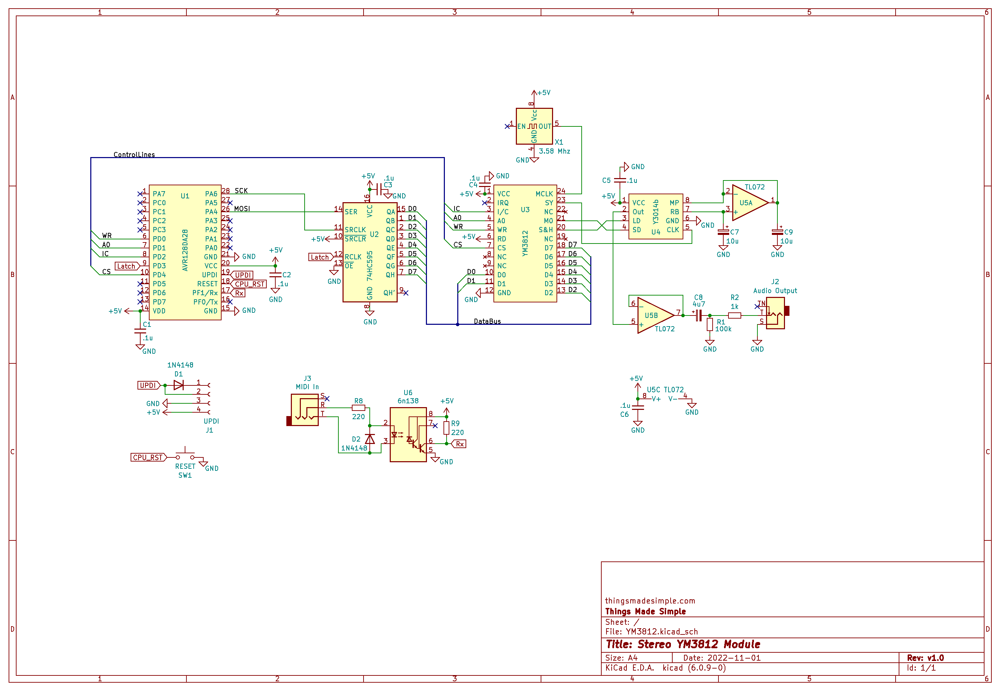

### <a href=''>YM3812 Part 4: MIDI Journey</a>
This article introduces the circuitry and functionality necessary to implement MIDI on the YM3812 module. This article especially focuses on translating note frequencies between MIDI note codes and the block / F-Number properties used by the YM3812. To demonstrate how the translation function and basic MIDI handlers work, this code implements a monophonic midi algorithm that plays all incoming notes on channel zero of the YM3812.

### Schematic
The schematic folder includes adds MIDI functionality to the basic schematic used in articles 1-3.

